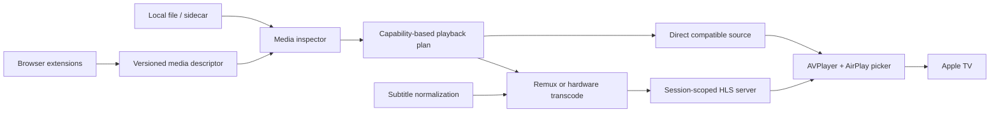

# Architecture and decisions

Status: proposed production architecture. Validate transport/subtitle assumptions in M0 before locking them into a release.

## Components and ownership

| Component | Owns | Does not own |
|---|---|---|
| Shared WebExtension core | Player selection, DOM video/track inspection, active-tab media discovery, descriptor creation | Video transcoding, receiver discovery, filesystem reads |
| Browser transports | Firefox/Chrome native messaging; Safari extension-to-containing-app bridge | Site parsing or media decisions |
| macOS UI (SwiftUI/AppKit) | Open/drop/share entrypoints, source/track/receiver choice, truthful session state | Codec heuristics and website conditionals |
| Session coordinator | Lifecycle, cancellation, retries, source-to-TV handoff acknowledgment | Browser DOM or FFmpeg argument construction |
| Media inspector/planner | Tracks, codecs, duration, DRM indicators, capability-based route selection | UI or arbitrary player interception |
| Subtitle pipeline | Timebase, language/flags, sidecars, WebVTT rendition generation, loss reporting | Silent burn-in or claiming ASS fidelity |
| Media worker | Bounded remux/transcode, hardware capability check, subprocess lifecycle | Global files or persistent browser credentials |
| Local media server | Only current session's allowed generated files, ranges, token revocation | Arbitrary paths, open proxy, general-purpose file serving |
| AirPlay adapter | AVPlayer, AVRoutePickerView, external playback state, media selection | Reimplementing Apple's private protocol |
| Diagnostics | Redacted events, bounded metrics and user-exported reports | Raw media URLs, tokens, cookies, unrelated tab data |

One repository, small modules and shared protocol fixtures. Avoid microservices, a database, event bus frameworks or separate apps per browser. Choose Swift Package modules for core logic after the proof; use Xcode app/extension targets for signing and Safari packaging. Prototype Python is a feasibility helper, not a distribution commitment. Evaluate a small native worker wrapper plus a pinned, licensed FFmpeg build before release; avoid assuming the user's Homebrew/Python paths.

## Data flow

External subtitle renditions may require packaging a compatible video source into HLS. Do not transcode solely because it has subtitles if a wrapper/remux is sufficient. Preserve the original master playlist, audio groups and subtitle groups whenever possible.

## Decisions

**D1 — Use Apple's public AirPlay stack.** AVPlayer external playback plus AVRoutePickerView are confirmed in the installed macOS SDK. Device behavior is unverified. Do not implement an undocumented AirPlay sender protocol.

**D2 — Capability-based media plans.** Ordered routes: direct play → playlist adaptation/remux → hardware transcode → actionable unsupported result. Plan records why it was chosen, expected CPU/cache, and every fidelity loss. HDR, surround, multiple audio and styled subtitles cannot silently become SDR/stereo/plain text.

**D3 — Shared browser logic, native transport adapters.** Chrome/Firefox support native messaging; Safari uses its containing app/extension packaging. Use authenticated/versioned local handoff rather than putting long private stream descriptors in URLs. A custom scheme may launch the app with a one-time opaque request ID only. Browser messages cannot specify arbitrary filesystem paths or arbitrary HTTP headers.

**D4 — Least-scope discovery.** Start with activeTab/user gesture; enumerate video/source/track elements across explicitly permitted frames. Observe network media only for the selected tab and bounded time when necessary. Cross-origin player domains require scoped grants. Tab navigation invalidates candidates. Keep candidate provenance (tab, frame, origin, time, MIME/manifest evidence); avoid casting an advertisement because it was the last media request.

**D5 — Subtitles are media tracks.** Build HLS EXT-X-MEDIA subtitle groups with WebVTT playlists and explicit timestamp mapping. Preserve multiple languages, names, default/forced status and offsets. Validate alignment with the encoded media timeline, not only source subtitle timestamps. Ensure receiver selection state matches UI selection and recover after route changes. HTML overlays without extractable cues are a separate unsupported case.

**D6 — Session ownership.** Single active receiver session initially. Every worker, cache path and URL belongs to a session ID/generation. Late callbacks from a replaced session cannot mutate the current one. Stop, errors, app termination and cancellation while inspecting/extracting all terminate child processes and revoke served access.

**D7 — Fast seek without unbounded cache.** Prefer original random-access files/remote VOD when compatible. HLS conversion uses a bounded cache and explicit seek capability. If a target segment is not prepared, the planner restarts at a requested time with a correct new timestamp epoch and subtitle offset. Do not falsely display full seek support for a partially prepared EVENT playlist.

**D8 — Receiver-reachable serving.** Apple TV cannot access the Mac's loopback address. Choose the actual LAN interface; test Wi-Fi/Ethernet, VPN and multiple interfaces. Bind the selected interface and expose only opaque session paths. Random high-entropy token, small header/request limits, bounded connections, path traversal protection, ranges and cancellation are required. Local HTTP is transport, not encryption; disclose LAN exposure and do not add an unrestricted proxy. Account for macOS local-network/firewall prompts.

**D9 — No opaque source execution.** Media URLs are data; no shell interpolation or executing downloaded scripts. Restrict FFmpeg protocol access and redirects, and enforce source policy through nested manifests. Browser-supplied sources cannot read local files or probe local services. Credential-bearing sources need explicit origin-scoped handling, redacted logs and no credential forwarding across origins.

## Session state machine

Idle → Discovering/Inspecting → PlanReady → Preparing → Ready → Connecting → Playing/Paused → Stopping → Idle.

Any active state may become Failed or Cancelled. Receiver loss becomes Recovering with bounded retries and then a visible choice. Distinguish `player ready`, `external playback active`, and `TV content/subtitles visually confirmed`; only the last is device acceptance evidence. Pin error codes and transitions in tests. A background helper that is still rendering after the UI says stopped is a lifecycle defect.

## Expansion boundaries

- New site: adapter + sanitized fixtures + shared descriptor; no receiver changes.
- New subtitle format: converter + fidelity metadata + timing tests; no browser changes.
- New receiver transport: implement receiver contract; retain planning and source discovery.
- New codec: inspector/capability matrix + route decision + media fixture; no UI conditions scattered through views.
- New queue: orchestrate complete session lifecycle; preserve one-session correctness first.

## Primary references consulted

- [Apple: supporting AirPlay](https://developer.apple.com/documentation/avfoundation/supporting-airplay-in-your-app)
- [Apple: AVRoutePickerView](https://developer.apple.com/documentation/avkit/avroutepickerview)
- [WebKit: Media Source Extensions and AirPlay](https://webkit.org/blog/15036/how-to-use-media-source-extensions-with-airplay/)
- [Mozilla: native messaging](https://developer.mozilla.org/en-US/docs/Mozilla/Add-ons/WebExtensions/Native_messaging)
- [Chrome: native messaging](https://developer.chrome.com/docs/extensions/develop/concepts/native-messaging)
- [Apple: Safari web extensions](https://developer.apple.com/documentation/safariservices/safari-web-extensions)
- [Apple: HLS with subtitle renditions](https://developer.apple.com/library/archive/documentation/NetworkingInternet/Conceptual/StreamingMediaGuide/UsingHTTPLiveStreaming/UsingHTTPLiveStreaming.html)
- [FFmpeg formats](https://ffmpeg.org/ffmpeg-formats.html)
